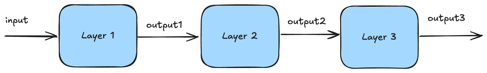
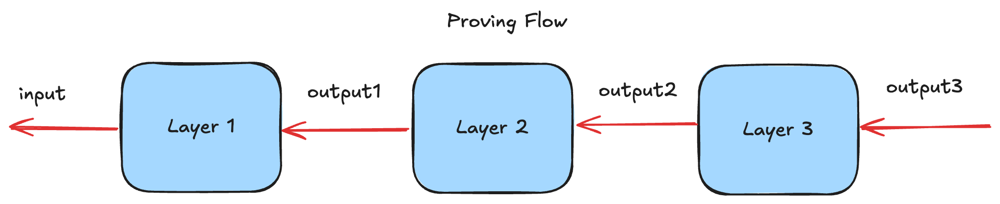
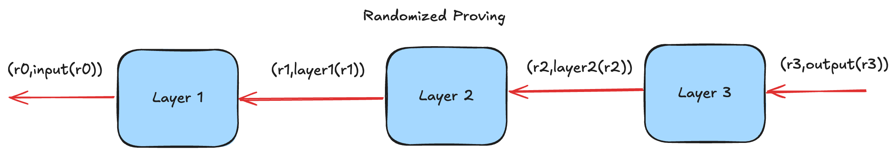

# High Level Overview

This document surveys the different techniques deep-prove uses.

## Supported Architecture

Currently, deep-prove supports [Multi Layer Percreptrons](https://en.wikipedia.org/wiki/Multilayer_perceptron) and [Convolutional Neural Networks](https://en.wikipedia.org/wiki/Convolutional_neural_network).

Specifically, we support the following layer:
* [Dense layer](https://keras.io/api/layers/core_layers/dense/)
* [RELU](https://en.wikipedia.org/wiki/Rectifier_(neural_networks))
* [MaxPool](https://deepai.org/machine-learning-glossary-and-terms/max-pooling),
* [Convolutions](https://en.wikipedia.org/wiki/Convolutional_neural_network)

Deep-prove is able to parse such models represented in the [ONNX file format](https://onnx.ai/).

## Proving Flow

First thing to do is to run the model natively, to collect the inference trace, e.g. all the intermediate values produced by each layer of the model.

Then deep-prove looks at the output of the inference, layer by layer, and proves each layer has correctly computed the output with high probability. 
However, the proving and verifying part actually work in _reverse_: the prover starts by proving *the last output* of the last layer is correctly computed from the last layer given the last input. 

The way it works is by using *randomized evaluations* of the polynomials defined by each layer. Instead of proving the full computation, one element per element, it only needs to prove the relation of a layer holds for a random input.

### Generic Layering

In general, each layer is expressed as a polynomial where the prover needs to prove the correct evaluation of this polynomial at a random point. 
Each layer in the proving flow receives an _input_ claim and produces _an output_ claim. 

In this diagram, each layer outputs a pair composed of a random point and the evaluation of the layer at that point.

For example, for a dense layer, the prover proves he correctly performed a matrix vector multiplication (a dense layer) by using a sumcheck protocol. This sumcheck produces an new evaluation claim on both the matrix and the input vector. The latter is the _output_ claim.

Note the verifier evaluates himself the input and output claims, since he knows the input and output of the model.

## Commitment

The setup phase looks at the model and commits to all the parameters, e.g. the weights, of the model. Instead of committing layer by layer, we are using an accumulation procedure to commit to only a _single_ polynomial.

Most layer will produce an evaluation claim to verify. Usually one would produce an opening proof such that the verifier can attest of the correctness of that claim. Instead, deep-prove
accumulates those claims during the proving and verification procedure to only produce/verify ONE opening proof over a large polynomial.

## Quantization

Traditionally, the parameters of a layer are defined over floating numbers in $[-1;1]$. However, (most) proof systems only deal with numbers inside a prime field. 
Deep-prove does two things:
* It quantizes the input and the model parameters, e.g. pass from a floating number to an integer between $[-2^{BIT\_LEN};2^{BIT\_LEN}-1]$. Typically, it would be $[-128;127]$
* It _requantizes_ the output of each layer. For example, after a matrix vector multiplication, the output range can be much more than $2^8$ (e.g. multiplying two 8 bit number can go up to $2^{16}-1$). Therefore, we need to requantize to make the output fit the quantization range again.

**Challenge**: Quantized models are very well known and known to loose some precision. The challenge is keep it high enough !

**Requantization Proving**: To prove requantization, we use an approximation where we right-shift all elements of the output of a layer to be within a certain range. 