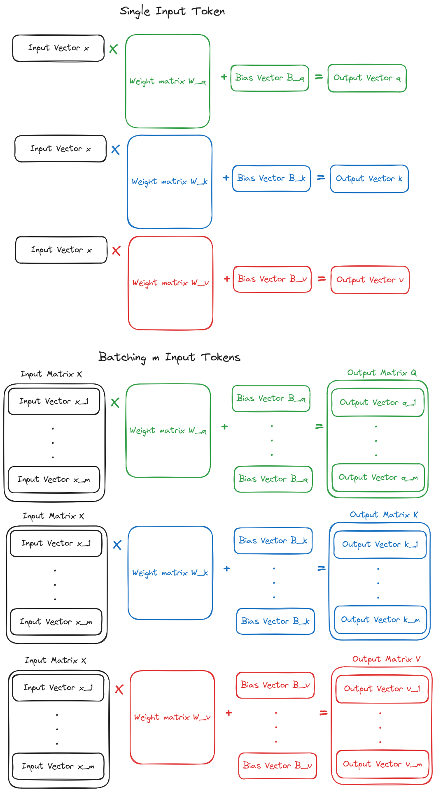
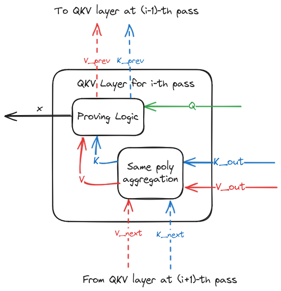

# QKV

## Description of the Layer
The **QKV** layer is the first layer found in each encoder/decoder of an LLM architecture, and it is employed to produce, for each word (or better, *token*) being processed by the LLM three vectors:

- A query vector $q \in \mathbb{R}^h$ 
- A key vector $k \in \mathbb{R}^h$ 
- A value vector $v \in \mathbb{R}^h$ 

where $h$ is a model hyper-parameter usually referred to as *hidden size* of the model.
These vectors are all computed from a vector $x \in \mathbb{R}^e$ representing a token processed by the LLM, where $e$ is another model hyper-parameter usually referred to as *embedding size*. More specifically, the output vectors are computed as follows:

- $q = xW_q + B_q$, where $W_q \in \mathbb{R}^{e \times h}$ is a weight matrix and $B_q \in \mathbb{R}^h$ is a bias vector
- $k = xW_k + B_k$, where $W_k \in \mathbb{R}^{e \times h}$ is a weight matrix and $B_k \in \mathbb{R}^h$ is a bias vector
- $v = xW_v + B_v$, where $W_v \in \mathbb{R}^{e \times h}$ is a weight matrix and $B_v \in \mathbb{R}^h$ is a bias vector

Since an LLM processes all the input tokens simultaneously, the computation of `q`, `k` and `v` vectors for all the input tokens is done in a "batched" fashon over matrices rather than over single vectors, as depicted in the following picture:

In particular:
- The `s` vectors $x_i \in \mathbb{R}^m$, each representing one of the `s` input tokens being processed, are concatenated in a matrix $X \in \mathbb{R}^{s \times e}$, where the $i$-th row of $X$ is equal to $X_i$
- Define the unitary vector as $\mathbb{1}_s = 1^s$. Given the bias vectors $B_q \in \mathbb{R}^h$, $B_k \in \mathbb{R}^h$ and $B_v \in \mathbb{R}^h$, define the *bias matrices* $B_q^s \in \mathbb{R}^{s \times h}= \mathbb{1}_s*B_q^T$, $B_k^s \in \mathbb{R}^{s \times h}= \mathbb{1}_s*B_k^T$ and $B_v^s \in \mathbb{R}^{s \times h}= \mathbb{1}_s*B_v^T$; in other words, each of the $s$ rows in a bias matrix is equal to the corresponding bias vector 
- The output matrices $Q \in \mathbb{R}^{s \times h}$, $K \in \mathbb{R}^{s \times h}$ and $V \in \mathbb{R}^{s \times h}$ are computed as:

    - $Q = XW_q + B_q^s$
    - $K = XW_k + B_k^s$
    - $V = XW_v + B_v^s$

    the $i$-th row of these matrices corresponds, respectively, to the query, key and value vectors of the $i$-th input token 

The QKV layer is basically computing these three matrices `Q`, `K` and `V` from the matrix `X` representing the input tokens

## Proving the Layer
Proving the three matrix multiplications to compute `Q`, `K` and `V` can be done with a single *batched* sum-check. 

The prover starts from the following 3 claims about the MLEs of the output matrices of the layer:

- Claim $y_Q$ about the MLE of matrix `Q`, computed at the random point $r_Q \in \mathbb{F}^{\log(s)+\log(h)}$; consider $r_Q$ to be split in 2 sub-points $r_Q^r \in \mathbb{F}^{\log(s)}$, $r_Q^c \in \mathbb{F}^{\log(h)}$, which are built from the coordinates of $r_Q$ referring to the rows and columns variables, respectively, of the MLE of `Q`
- Claim $y_K$ about the MLE of matrix `K`, computed at the random point $r_K \in \mathbb{F}^{\log(s)+\log(h)}$; consider $r_K$ to be split in 2 sub-points $r_K^r \in \mathbb{F}^{\log(s)}$, $r_K^c \in \mathbb{F}^{\log(h)}$, which are built from the coordinates of $r_K$ referring to the rows and columns variables, respectively, of the MLE of `K`
- Claim $y_V$ about the MLE of matrix `V`, computed at the random point $r_V \in \mathbb{F}^{\log(s)+\log(h)}$; consider $r_V$ to be split in 2 sub-points $r_V^r \in \mathbb{F}^{\log(s)}$, $r_V^c \in \mathbb{F}^{\log(h)}$, which are built from the coordinates of $r_V$ referring to the rows and columns variables, respectively, of the MLE of `V`

Furthermore, the prover has computed the MLEs of the weight matrices $W_q$, $W_k$ and $W_v$ and the MLEs of the bias vectors $B_q$, $B_k$ and $B_v$, which were commited to in a setup phase. 

Given the 3 claims $y_Q$, $y_K,$ and $y_V$, the prover computes also the claims $y_{B_q} = B_q(r_Q^c)$, $y_{B_k} = B_k(r_K^c)$ and $y_{B_v} = B_v(r_V^c)$, and claims $\widetilde{y_Q} = y_Q - B_q(r_Q^c)$, $\widetilde{y_K} = y_K - B_k(r_K^c)$, $\widetilde{y_V} = y_V - B_V(r_V^c)$.

Given the 3 claims $y'_Q$, $y'_K$, $y'_V$, the verifier samples random challenges $\lambda_1$, $\lambda_2$ and then the prover employs a sum-check protocol to prove the relationship:
\begin{equation}
\scriptsize
\widetilde{y_Q} + \lambda_1 \widetilde{y_K} + \lambda_2 \widetilde{y_V} = \sum_{x \in \{0,1\}^{\log(e)}} X(r_Q^r, x)*W_Q(x, r_Q^c) + \lambda_1 X(r_K^r, x)*W_K(x, r_K^c) + \lambda_2 X(r_V^r, x)*W_V(x,r_V^c)
\tag{1}
\end{equation}

Where $X$ is the MLE of the input matrix `X`. At the end of the sum-check protocol, for a random $r \in \mathbb{F}^{\log(e)}$ the following claims are produced:

- 3 claims $X(r_Q^r, r)$, $X(r_K^r, r)$, $X(r_V^r, r)$, which can be accumulated in a single claim for the MLE polynomial $X$, using the [same poly technique](https://github.com/Lagrange-Labs/deep-prove/blob/c2752df53be1b4b6832e452b6cbca17e3543556b/docs/src/commitments.md#accumulation-for-same-polynomial). 
- 3 Claims $y_{W_Q} = W_Q(r, r_Q^c)$, $y_{W_K} = W_K(r, r_K^c)$, $y_{W_V} = W_V(r, r_V^c)$, which will be bound to the corresponding weight polynomial through an opening proof of the polynomial commitment scheme, as described in the next section.

### Polynomial Commitment Operations
The proving protocol requires the prover to commit to the weight matrices $W_q$, $W_k$ and $W_v$, and to the MLEs of the bias vectors $B_q$, $B_k$ and $B_v$. However, since these polynomials depend only on the parameters of the model, which are input-independent, these commitments can be pre-computed by the prover in a setup phase.

Then, when proving the inference for a given input matrix $X$, the prover needs to bind the following claims, produced in the proving protocol, to the corresponding polynomial committed in the setup phase, employing a PCS opening proof:

- The claims $y_{W_Q}$, $y_{W_K}$, $y_{W_V}$ about the MLEs of the weight matrices $W_q$, $W_k$ and $W_v$, repsectively
- The claims $y_{B_q}$, $y_{B_k}$, $y_{B_v}$ about the MLEs of the bias vectors $B_q$, $B_k$ and $B_v$, respectively

## Proving Passes over Output Tokens
In a LLM like GPT2, the inference is an iterative process: the same layers are evaluated multiple times, producing each time an output token. In all iterations except the first one, the input matrix $X_i$ of the QKV layer is the row-wise concatenation of the input matrix $X_{i-1}$ employed in the previous iteration and the vector $x$ representing the output token of the previous iteration. Therefore, also the `Q`, `K` and `V` matrices computed by the QKV layer are a concatenation of the corresponding matrices computed in the previous iteration and the vectors `q`, `k` and `v` computed for the new input row `x`. 

To avoid the cost of a full matrix multiplication in each iteration after the first one, it is thus possible to compute only the vectors `q`, `k` and `v` from the input row `x`, and then concatenate each vector with the corresponding matrices produced by the QKV layer in the previous iteration. 

Most importantly, concatenation is not necessary at all for the matrix Q computed by the QKV layer: instead, the layer just needs to output the vector `q` computed for the new input row `x`.

Therefore, the QKV layer in sub-sequent forward passes has the following input/output tensors:

- Input vector $x \in \mathbb{R}^e$ for the new token
- Output vector $q \in \mathbb{R}^h$
- Output matrices $K \in \mathbb{R}^{s \times h}$, $V \in \mathbb{R}^{s \times h}$ 

### Proving
When proving QKV layers, we employ output matrices $K$ and $V$ with a fixed number of rows across all iterations. More specifically, the output matrices, rather than having the actual shape $[\mathtt{seq\_len}, \mathtt{hidden\_size}]$, where $\mathtt{seq\_len}$ increases at each iteration depending on the number of tokens processed so far, have always shape $l \times h$, where $l$ is the *context-length* of the model, that is the maximum number of tokens that can be processed. The padded matrices are built from the actual output matrices by padding with $l - \mathtt{seq\_len}$ rows filled with 0s. In the following, for the sake of conciseness of the formulas, we will use $s$ in place of $\mathtt{seq\_len}$. Wlog, in the following we assume that both $l$ and $h$ are powers of 2; otherwise, all the input/output tensors can be padded with 0 to reach the next power of 2.

This simplifies the MLEs employed to prove the correct concatenation of the vector $k$ and $v$ computed for the input $x$ with the matrices $K_{prev}$ and $V_{prev}$ produced as outputs in the previous iteration. 

The concatenation over the padded matrix $K \in \mathbb{R}^{l \times h}$ (and similarly for $V \in \mathbb{R}^{l \times h}$) is defined as follows.

- Consider the padded matrix $K_{prev} \in \mathbb{R}^{l \times h}$ computed by the same layer in previous iteration. This matrix has $s-1$ actual rows and $l - s + 1$ padded rows
- The padded matrix $K \in \mathbb{R}^{l \times h}$ computed in the current iteration must have $s$ actual rows, where the first $s-1$ rows are equal to the first $s-1$ rows of $K_{prev}$, and the $s$-th row is equal to the vector $k$ computed in the current iteration.

Proving the QKV layer is therefore done in 2 steps:

1. The computation of vectors `q`, `k` and `v` from the new input row `x` is proven
2. The construction of the output matrices $K \in \mathbb{R}^{l \times h}$ and $V \in \mathbb{R}^{l \times h}$ by proving concatenation of vectors $k \in \mathbb{R}^h$ and $v \in \mathbb{R}^h$ with the corresponding matrices $K_{prev} \in \mathbb{R}^{l \times h}$ and $V_{prev} \in \mathbb{R}^{l \times h}$ computed in the previous iteration. 

Since proving currently proceeds in reverse order w.r.t. inference, we start by describing how to prove step 2.

#### Prove Concatenation
We first show a generic proving sub-protocol to prove concatenation. Given a matrix $M_{prev} \in \mathbb{F}^{(s-1) \times h}$, with $s \le l$, and a vector $m \in \mathbb{F}^h$, this protocol allows to prove the construction of a matrix $M \in \mathbb{F}^{l \times h}$ where the first $s-1$ rows correspond to matrix $M_{prev}$, the $s$-th row corresponds to vector $m$, and the remaining $l-s$ rows are 0s.

The prover first decomposes the output matrix $M$ in 2 matrices computed as follows:

- $\widetilde{M_{prev}} \in \mathbb{F}^{l \times h}$ is a matrix where the first $s-1$ rows correspond to $M_{prev}$ and the other $l-s+1$ rows are 0
- $\widetilde{m} \in \mathbb{F}^{l \times h}$ is a matrix where the $s$-th row is equal to vector $m$, while all other $l-1$ rows are 0

It is straightforward to see that $M[i,j] = \widetilde{M_{prev}}[i, j] + \widetilde{m}[i,j]$. This decomposition can be trivially proved by evaluating the MLEs of matrices $M$, $\widetilde{M_{prev}}$ and $\widetilde{M}$ at a random point $r \in \mathbb{F}^{\log(w*h)}$, and checking that $M(r) = \widetilde{M_{prev}}(r) + \widetilde{m}$(r).

Then, we need to bind the MLE of $\widetilde{M_{prev}}$ to the original input matrix $M_{prev}$, and the MLE of $\widetilde{m}$ to the original input vector $m$. We show how to do this for the vector $m$, but a similar strategy can easily be derived for matrix $M_{prev}$ (though it will not be necessary in our actual protocol).

The computation of $\widetilde{m}$ from $m$ can be proven as follows. Define the pad vector $P \in \mathbb{F}^{l}$ as the vector where $P[s] = 1$ and all other entries are 0. Then the matrix $\widetilde{m}$ can be computed from $m$ and $P$ as:
$$
\widetilde{M}[i, j] = P[i]*m[j]
$$ 
We can prove this relation via sum-check protocol[^note]. Given the claim $y_{\widetilde{M}} = \widetilde{m}(r)$, for a random point $r \in \mathbb{F}^{\log(l*h)}$, the prover proves the following relationship via sum-check:
\begin{equation}
y_{\widetilde{M}} = \sum_{x \in \{0, 1\}^{\log(l)}} \sum_{y \in \{0, 1\}^{\log(h)}} \beta(x||y, r) * P(x) * m(y)
\tag{2}
\end{equation}
The sum-check proof will produce the following claims for a random point $r_s \in \mathbb{F}^{\log(l*h)} = (r_l \in \mathbb{F}^{\log(l)}, r_h \in \mathbb{F}^{\log{h}})$:

- Claim $\beta(r_s, r)$, which can be verified efficienctly by the verifier
- Claim $P(r_l)$, which can be verified efficiently by the verifier as well: indeed, given that P has only one non-zero entry (i.e., $P[s] = 1$), its MLE is simply $P(x) = \beta(x, \mathtt{BitDecompose}(s))$, where $\mathtt{BitDecompose}(s)$ is the sequence of $\log(l)$ bits representing $s$; therefore, $P(r_l) = \beta(r_l, s)$. 
- Claim $m(r_h)$, which is the claim about the input vector $m$ produced by the proving sub-protocol

We could also get a claim for the MLE $M_{prev}$ from $\widetilde{M_{prev}}$ with a similar sum-check, but we don't show it here because it won't be necessary when using this sub-protocol to prove concatenation in the QKV layer. 

#### Concatenation in QKV Layer
We now show how to use the concatenation sub-protocol to prove the concatenation of matrices $K_{prev} \in \mathbb{R}^{l \times h}$ and $V_{prev} \in \mathbb{R}^{l \times h}$, computed in the previous iteration, with the vectors $k \in \mathbb{R}^h$ and $v \in \mathbb{R}^h$, respectively, computed in the current iteration for the new token $x$.

Following the concatenation sub-protocol, we define the matrices $\widetilde{K_{prev}}$, $\widetilde{V_{prev}}$, $\widetilde{k}$, $\widetilde{v}$. Note that $K_{prev} = \widetilde{K_{prev}}$ and $V_{prev} = \widetilde{V_{prev}}$, because $K_{prev}$ and $V_{prev}$ has already the same shape of output matrices $K$ and $V$, and so they don't need to be padded.

The prover starts from claims $y_K$, $y_V$ for the MLEs of the output matrices $K$ and $V$, computed at random points $r_K \in \mathbb{F}^{\log(l*h)}$ and $r_V \in \mathbb{F}^{\log(l*h)}$. The prover then computes claims $Y_{K_{prev}} = K_{prev}(r_K)$, $Y_{V_{prev}} = V_{prev}(r_V)$, $y_{\widetilde{k}} = \widetilde{k}(r_K)$, $y_{\widetilde{v}} = \widetilde{v}(r_V)$, and checks that:
\begin{equation}
    y_K = y_{K_{prev}} + y_{\widetilde{k}} \tag{3}
\end{equation}
\begin{equation}
    y_V = y_{V_{prev}} + y_{\widetilde{v}} \tag{4}
\end{equation}

Claims $y_{K_{prev}}$ and $y_{V_{prev}}$ are claims to the MLE of the matrices $K_{prev}$ and $V_{prev}$ computed in the previous iteration, and so they later need to be bound to the outputs of the QKV layer proven in the previous iteration, as discussed [below](#bind-claims-with-previous-iteration).

Instead, the claims $\widetilde{k}$, $\widetilde{v}$ need to be bound to claims about the MLEs of the vectors $k$ and $v$, respectively. This is done with a batched sum-check based on the same relationship proven in Equation (2).

In particular, the prover asks to the verifier a random challenge $\lambda$, and then proves the following equation via sum-check:
$$
y_{\widetilde{k}} + \lambda y_{\widetilde{v}} = \sum_{x \in \{0, 1\}^{\log(l)}} \sum_{y \in \{0, 1\}^{\log(h)}} \beta(x||y, r_K) * P(x) * k(y) + \lambda \beta(x||y, r_V) * P(x) * v(y)
$$

The sum-check proof will produce the following claims for a random point $r \in \mathbb{F}^{\log(l*h)} = (r_l \in \mathbb{F}^{\log(l)}, r_h \in \mathbb{F}^{\log{h}})$:

- Claims $\beta(r, r_K)$, $\beta(r, r_V)$ which can be verified efficienctly by the verifier
- Claim $P(r_l)$, which can be verified efficiently by the verifier as well, given the simple structure of the MLE of P
- Claims $k(r_h)$, $v(r_h)$, which correspond to the claims about the input vector $k$ and $v$ produced by the proving protocol. These claims can then be employed to prove the computation of the $k$, $v$ vectors from the input $x$ of the QKV layer, as shown next.

#### Prove Computation of New Vectors
To prove the computation of $q$, $k$ and $v$ vector for the new processed input token $x$, we use a simplied variant of the sum-check employed in the general QKV layer, described in Equation (1). The proving starts from 3 claims $y_q$, $y_k$ and $y_v$: the first one is coming directly from the output claims of the QKV layer, and it is computed over a random point $r_q \in \mathbb{F}^{\log(h)}$; the latter claims correspond to the claims $y_k$ and $y_v$ employed to prove concatenation in the same layer, and so they are evaluated over the same point $r_h \in \mathbb{F}^{\log{h}}$. 

Given random challenges $\lambda_1$, $\lambda_2$ provided by the verifier, the prover computes the claims $B_q(r_q)$, $B_k(r)$, $B_v(r)$ and generates a sum-check proof for the following relationship:
$$ 
\footnotesize
y_q - B_q(r_q) + \lambda_1 (y_k - B_k(r))  + \lambda_2 (y_v - B_v(r)) = \sum_{z \in \{0,1\}^{\log(e)}} X(z)*(W_Q(z, r_q) + \lambda_1 W_K(z, r_h) + \lambda_2 W_V(z,r_h))
$$
where $X$ is the MLE of the input row $x$.

The claim obtained about the MLE $X$ will be the input claim of the QKV layer, while all the claims related to the weight matrices and to the bias vectors will be proven via an opening proof for corresponding committed polynomials.

#### Bind Claims With Previous Iteration

Note that the claims $y_{K_{prev}}$ and $y_{V_{prev}}$, computed by the prover when proving concatentation, needs to be bound to the MLEs of the output matrices $K_{prev}$ and $V_{prev}$ computed in the previous iteration for the same QKV layer.

This diagram shows the input and output claims of QKV layer. The dashed lines represent claims which are shared with preceding or sub-sequent passes, while the solid lines represents the claims related to the actual input and output tensors of the layer.

From the diagram, we see that when proving concatenation for the i-th iteration, the prover has 2 claims for each of the output matrices $K$ and $V$ of the layer:

- Claims $y_{K_{out}}$, $y_{V_{out}}$ coming from the sub-sequent layers, which are the output claims of the QVK layer being proven
- Claims $y_{K_{next}}$, $y_{V_{next}}$, which corresponds to the claims $y_{K_{prev}}$, $y_{V_{prev}}$ produced by the sum-check proof for concatenation in the (i+1)-th iteration, for the same QKV layer

The 2 claims for each of the matrices $K$ and $V$ are aggregated in a single one, using the [same poly technique](https://github.com/Lagrange-Labs/deep-prove/blob/c2752df53be1b4b6832e452b6cbca17e3543556b/docs/src/commitments.md#accumulation-for-same-polynomial). The claims $y_K$ and $y_V$ produced by the same-poly aggregation are then used as the claims for the output matrices $K$ and $V$ in the proving protocol outlined above. More specifically, these claims are employed as claims $y_K$, $y_V$ in Equations (3) and (4) during the concatenation proving protocol for the current iteration.

This allows to bind the claims computed over MLEs chosen by the prover at iteration $i+1$ to the actual output matrices produced by the same QKV layer at iteration $i$.